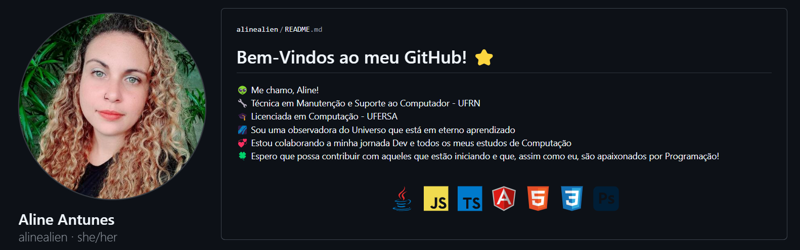
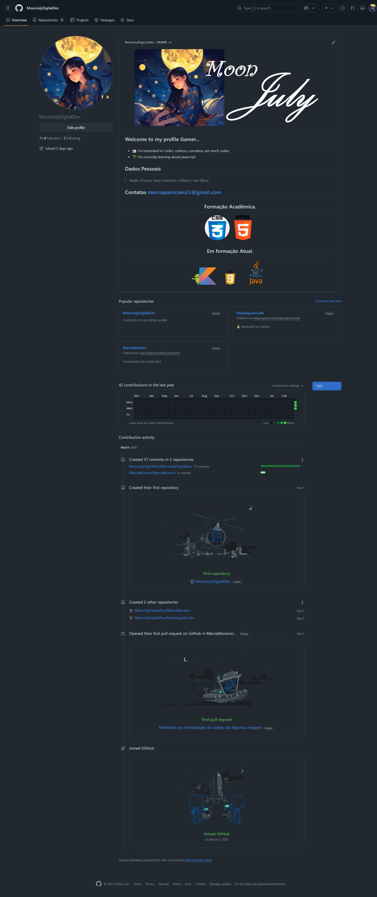
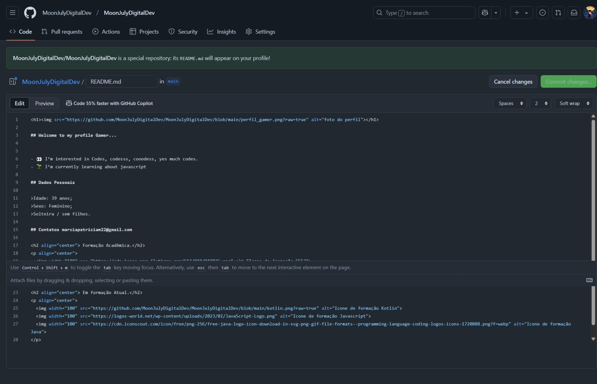
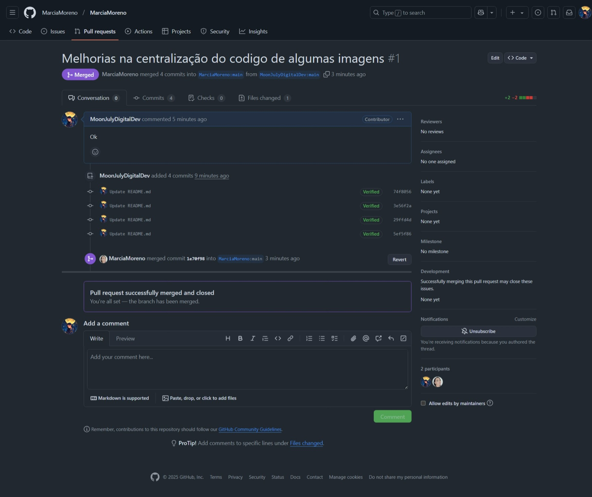
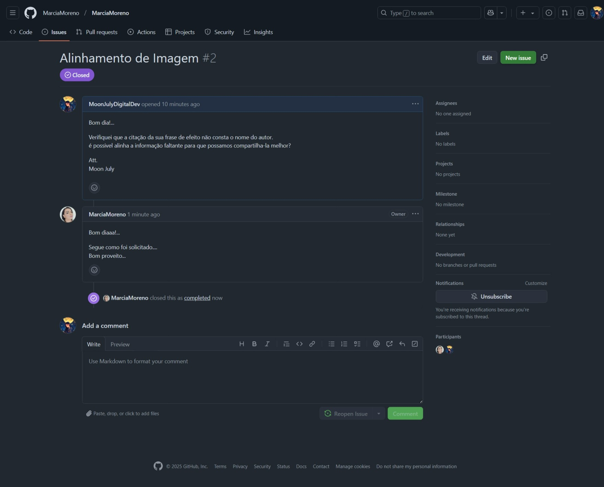

# Desafio 01 - Curso GitHub - <a href="https://web.dio.me/">DIO [Digital Inovation One]</a>. 

## Objetivos do desafio:

1. Criar um perfil no Git Hub.
2. Estilizar o arquivo README.md respectivamente sobre o intuito de explainar o motivo da existência do canal, bem como sua principal funcionalidade e atividade principal.
3. Realizar e resolver um pull-request com um usuário GitHub existente ou com uma conta própria atrelada ao canal. 
4. Realizar e finalizar uma 'Issue'. 

## Orientador

>Projeto Concluido em 05/03/2025 

>Print do Objetivo 01

>Print do Objetivo 02

>Print do Objetivo 03

>Print do Objetivo 04

