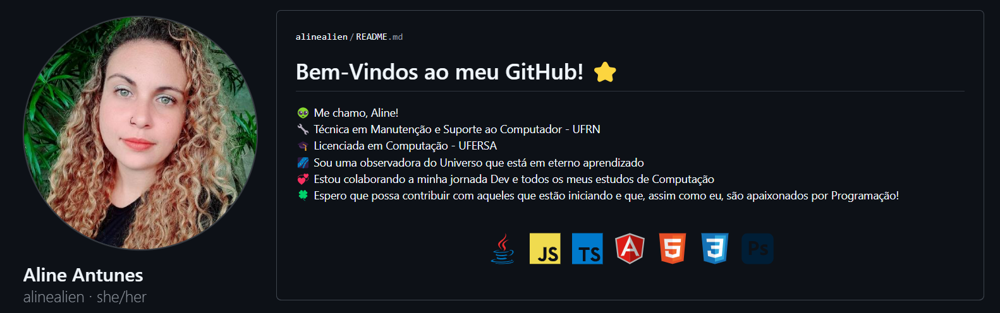
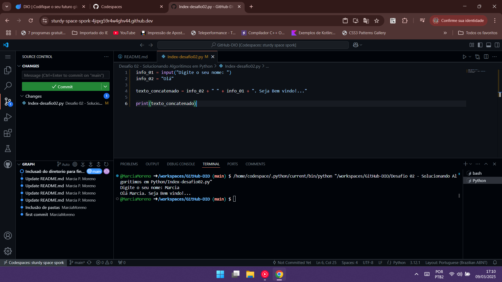
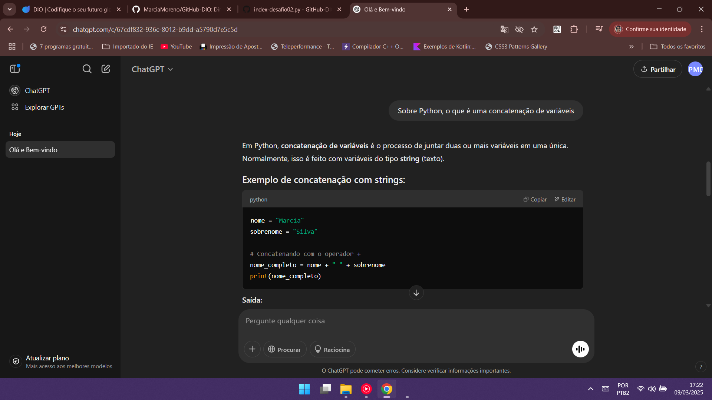
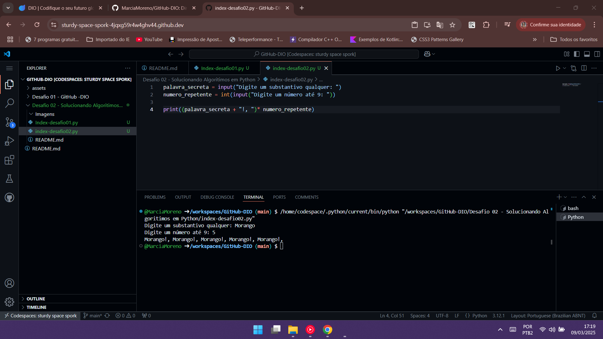
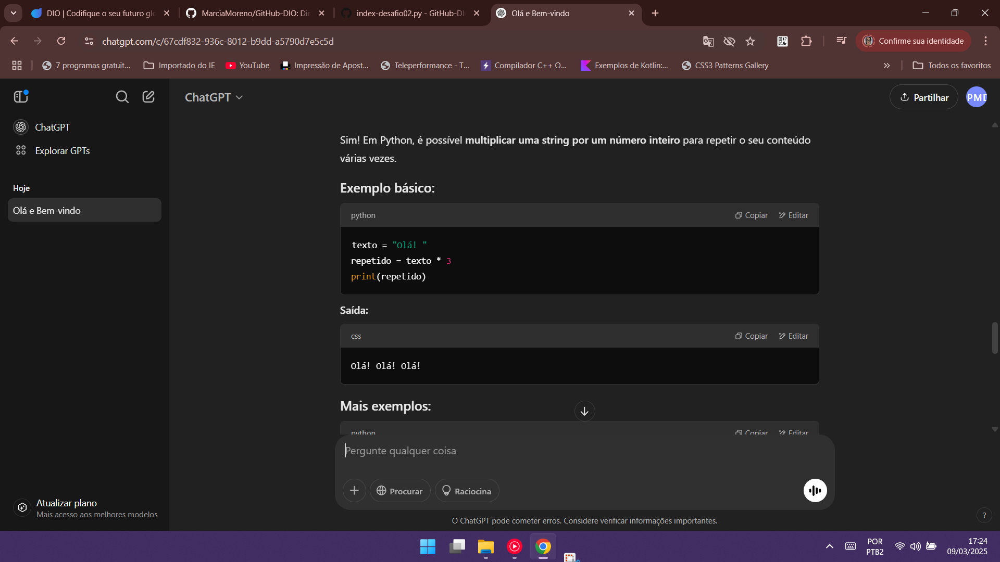

# Desafio 02 - Curso GitHub - <a href="https://web.dio.me/">DIO [Digital Inovation One]</a>. 

## **Utilizando as Ferramentas do Github para Solucionar Algoritmos em Python**

## Objetivos do desafio:

1. Criar dois arquivos com a extensão python conforme solicitado no escopo de orientação do desafio.
2. O primeiro script, vai receber uma variavel questionando o nome do usuário e em seguida com o input de uma segunda palavra, gerar uma frase na tela via terminal. 
3. O segundo script deve receber uma variavel via input e multplicado por um numero inteiro que também deve ser inserido via sistema, mostrado em tela nas mesma quantidade solicitada no input.
4. Realizar e finalizar pesquisas com temas referentes ao scripts realizados via Git Copilot ou ChatGpt. 

## Orientador

>Projeto Concluido em 09/03/2025 

>Script 01: 

>Pesquisa realizada via ChatGPT: 

>Script 02:

>Pesquisa realizada via ChatGPT: 

